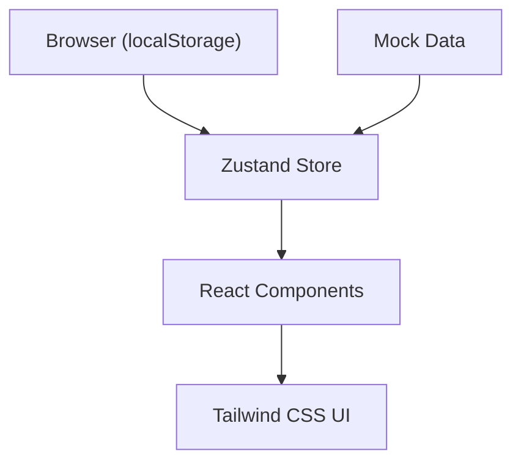
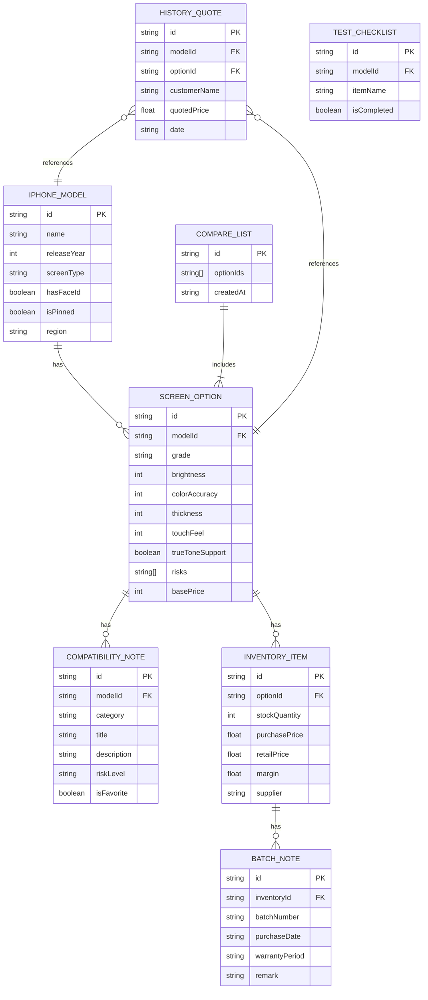

## 1. 架构设计

纯前端单页应用，所有数据存储在浏览器 localStorage，无需后端服务。使用 zustand 管理全局状态，react-router-dom 管理路由。



## 2. 技术描述

- **前端框架**：React@18 + TypeScript
- **构建工具**：Vite@5
- **路由**：react-router-dom@6
- **状态管理**：zustand@4
- **样式**：Tailwind CSS@3
- **图标**：lucide-react
- **数据存储**：localStorage（持久化）
- **无后端**：纯前端应用，mock 数据内置

## 3. 路由定义

| Route | Purpose |
|-------|---------|
| `/` | 型号选择页 |
| `/screen-options` | 屏幕方案页 |
| `/compatibility` | 兼容提醒页 |
| `/inventory` | 库存报价页 |
| `/compare` | 对比清单页 |

## 4. 数据模型

### 4.1 数据模型定义



### 4.2 数据结构（TypeScript 类型）

```typescript
// 型号
interface IphoneModel {
  id: string;
  name: string;
  releaseYear: number;
  screenType: 'OLED' | 'LCD';
  hasFaceId: boolean;
  isPinned: boolean;
  region: 'CN' | 'Global';
}

// 屏幕方案
interface ScreenOption {
  id: string;
  modelId: string;
  grade: 'original' | 'refurbished' | 'chinese-oled' | 'lcd-replacement';
  gradeName: string;
  brightness: number; // 0-100
  colorAccuracy: number; // 0-100
  thickness: number; // 0-100 (越低越好)
  touchFeel: number; // 0-100
  trueToneSupport: boolean;
  risks: string[];
  basePrice: number;
}

// 兼容提醒
interface CompatibilityNote {
  id: string;
  modelId: string;
  category: 'earpiece' | 'true-tone' | 'sealant' | 'bracket' | 'screw';
  title: string;
  description: string;
  riskLevel: 'low' | 'medium' | 'high';
  isFavorite: boolean;
}

// 库存报价
interface InventoryItem {
  id: string;
  optionId: string;
  stockQuantity: number;
  purchasePrice: number;
  retailPrice: number;
  supplier: string;
  batchNotes: BatchNote[];
}

// 批次备注
interface BatchNote {
  id: string;
  inventoryId: string;
  batchNumber: string;
  purchaseDate: string;
  warrantyPeriod: string;
  remark: string;
}

// 选择参数
interface SelectionParams {
  modelId: string;
  region: 'CN' | 'Global';
  faceIdStatus: 'normal' | 'abnormal';
  originalScreenType: 'OLED' | 'LCD';
  budget: number;
}

// 全局状态
interface AppState {
  selection: SelectionParams;
  pinnedModels: string[];
  favorites: string[];
  compareList: string[];
  historyQuotes: HistoryQuote[];
}
```

## 5. 项目结构

```
src/
├── components/        # 可复用组件
│   ├── Layout.tsx     # 布局组件（导航栏）
│   ├── ModelCard.tsx  # 型号卡片
│   ├── ScreenCard.tsx # 屏幕方案卡片
│   ├── ProgressBar.tsx # 参数进度条
│   ├── NoteItem.tsx   # 兼容提醒项
│   ├── DataTable.tsx  # 库存表格
│   └── CompareCard.tsx # 对比卡片
├── pages/             # 页面组件
│   ├── ModelSelect.tsx
│   ├── ScreenOptions.tsx
│   ├── Compatibility.tsx
│   ├── Inventory.tsx
│   └── CompareList.tsx
├── store/             # 状态管理
│   └── useAppStore.ts
├── data/              # Mock 数据
│   ├── models.ts
│   ├── screenOptions.ts
│   ├── compatibility.ts
│   └── inventory.ts
├── types/             # 类型定义
│   └── index.ts
├── utils/             # 工具函数
│   ├── storage.ts
│   └── formatter.ts
├── App.tsx
├── main.tsx
└── index.css
```

## 6. 核心实现要点

1. **localStorage 持久化**：全局状态变更自动同步到 localStorage，刷新不丢失
2. **状态选择器**：使用 zustand 的选择器优化渲染性能
3. **Mock 数据生成**：内置完整的 iPhone 型号数据和屏幕方案数据
4. **参数联动**：型号选择后自动过滤对应的屏幕方案和兼容提醒
5. **排序筛选**：库存报价页支持多列排序、价格区间筛选
6. **对比清单**：最多选择 3 个方案，实时生成对比卡片
7. **常用置顶**：支持长按/双击型号卡片置顶，按时间倒序排列
